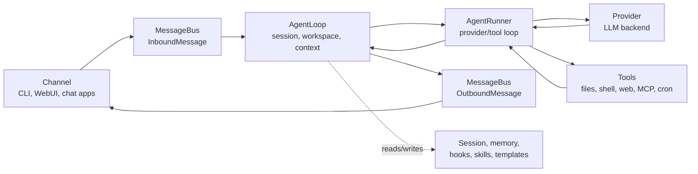

# Architecture

This page maps mira's runtime behavior to source files. Use it when you are debugging internals, reviewing a PR, adding a provider/channel/tool, or trying to understand where a user-visible behavior comes from.

For the product-level mental model, read [`concepts.md`](./concepts.md) first.

## Core Flow



Main files:

| Area | Files |
|---|---|
| Message events and queue | `mira/bus/events.py`, `mira/bus/queue.py` |
| Turn orchestration | `mira/agent/loop.py` |
| Provider/tool conversation loop | `mira/agent/runner.py` |
| Context construction | `mira/agent/context.py` |
| Session storage and compaction | `mira/session/manager.py` |
| Long-term memory and Dream | `mira/agent/memory.py` |

## Product Boundary: Kernel vs GUI

For long-term product maturity, treat mira as two layers even when they ship
from one repository:

- `kernel`: session state, model/tool loop, approvals, memory, runtime policy;
- `gui`: input, output, visualization, approvals UI, file diff display.

The kernel boundary now has an explicit stable namespace under
`mira/kernel/`:

| Kernel surface | Files |
|---|---|
| Thin mature-agent facade | `mira/kernel/app.py` |
| Normalized GUI-facing events | `mira/kernel/events.py` |
| Public exports | `mira/kernel/__init__.py` |

This layer is intentionally narrower than the full SDK:

- GUI code should depend on `KernelApp`, not directly on `AgentLoop`;
- GUI code should render normalized `KernelEvent` values, not provider-specific streaming details;
- deep runtime integrations can still use the underlying `mira` or lower-level modules when needed.

This is the preferred direction for keeping the agent mature without letting the
front-end or channel surfaces couple themselves to internal orchestration.

## Shell Model and Host Contract

The WebUI should treat shell configuration as a thin contract layered on the kernel.

Authoritative files:

| Concern | Files |
|---|---|
| Backend shell descriptor | `mira/kernel/shell.py` |
| Frontend shell registration and coercion | `webui/src/shells/registry.ts` |
| Shell data attributes and shared view metadata | `webui/src/shells/contract.ts` |
| Shell view contracts | `webui/src/shells/types.ts` |

Grouped host contract fields are the stable API:

- `chrome`
- `surfaces`
- `actions`
- `composer`
- `privilege`

Do not reintroduce older flat capability flags. If a shell needs a new affordance, add it to the grouped contract and thread it through both backend and frontend explicitly.

Privilege-sensitive runtime actions should be declared by the kernel and enforced by the shell contract, then reflected in operator surfaces. The console should not guess privilege from wording alone.

## Native Bridge Boundary

Mira's native/runtime-control path should stay behind explicit kernel-facing boundaries.

Current direction:

- Python remains the orchestration layer.
- Native bridge work should expose narrow ABI-style surfaces for runtime control, board/embedded integration, or performance-sensitive execution paths.
- Shells consume normalized runtime state and action metadata rather than native implementation details.

When extracting Rust/C components:

1. keep the Python kernel contract stable first
2. move hot or OS-facing paths behind explicit bridge surfaces
3. avoid leaking native-specific branching into shell code

This keeps Mira small at the core while still allowing deeper runtime or embedded control in the future.

## Agent Loop vs Agent Runner

`AgentLoop` owns the channel-facing turn:

- receives inbound messages;
- determines the effective session and workspace scope;
- builds context;
- wires hooks, progress, and channel metadata;
- publishes outbound messages.

`AgentRunner` owns the model-facing loop:

- sends messages to the selected provider;
- handles streaming deltas and reasoning blocks;
- executes tool calls;
- feeds tool results back into the model;
- stops when a final answer is produced or runtime limits are hit.

Keep this split in mind when debugging. If a problem is about channel routing, session keys, workspace selection, or outbound delivery, start in `agent/loop.py`. If it is about provider calls, tool calls, streaming, or iteration limits, start in `agent/runner.py`.

## Providers

Provider metadata is centralized in `mira/providers/registry.py`. Configuration fields live in `mira/config/schema.py`.

Provider selection uses:

- explicit `agents.defaults.provider` or preset provider;
- provider registry keywords;
- API key prefixes and API base URL hints;
- local provider fallback when `apiBase` is configured;
- gateway fallback for providers that can route many model families.

Provider implementations live in `mira/providers/`. Most hosted providers use the OpenAI-compatible implementation, while Anthropic, Azure OpenAI, AWS Bedrock, OpenAI Codex, and GitHub Copilot have specialized paths.

Useful docs:

- [`providers.md`](./providers.md) for practical setup;
- [`configuration.md#providers`](./configuration.md#providers) for exact provider reference.

## Channels

Channels translate external platforms into `InboundMessage` events and send `OutboundMessage` events back to the platform.

Main files:

| Area | Files |
|---|---|
| Base channel contract | `mira/channels/base.py` |
| Channel packages | `mira/channels/<channel>/` |
| Discovery and lifecycle | `mira/channels/manager.py` |
| WebSocket/WebUI channel | `mira/channels/websocket/` |

Channels are discovered by scanning self-contained packages under `mira/channels/`. Add a channel by contributing one package that follows [`channel-package-guide.md`](./channel-package-guide.md).

## WebUI and Gateway

`mira gateway` starts:

- enabled chat channels;
- the WebSocket channel when configured;
- workspace-scoped cron service;
- system jobs such as Dream and heartbeat;
- the health endpoint on `gateway.port`.

The packaged WebUI is served by the WebSocket channel, not the health endpoint:

| Surface | Default |
|---|---|
| Health endpoint | `http://127.0.0.1:18790/health` |
| WebUI/WebSocket | `http://127.0.0.1:8765` |

WebUI source lives in `webui/`. The production build is written to `mira/web/dist/` and bundled into the wheel.

Useful docs:

- [`webui.md`](./webui.md) for the WebUI user guide;
- [`../webui/README.md`](../webui/README.md) for frontend source development;
- [`websocket.md`](./websocket.md) for protocol details.

## Tools

Tools are discovered from `mira/agent/tools/` and plugin entry points.

Important files:

| Tool area | Files |
|---|---|
| Tool base and schema | `mira/agent/tools/base.py`, `mira/agent/tools/schema.py` |
| Discovery | `mira/agent/tools/registry.py` |
| Shell execution | `mira/agent/tools/shell.py` |
| Filesystem tools | `mira/agent/tools/filesystem.py` |
| Web search/fetch | `mira/agent/tools/web.py` |
| MCP tools | `mira/agent/tools/mcp.py` |
| Cron | `mira/agent/tools/cron.py`, `mira/cron/` |
| Image generation | `mira/agent/tools/image_generation.py` |
| Runtime self-inspection | `mira/agent/tools/self.py` |

Tool behavior is part of the model contract. Keep user-visible tool names, schemas, and error messages stable unless a change is intentional.

## Config and Paths

The config schema lives in `mira/config/schema.py`. Loading and saving live in `mira/config/loader.py`. Runtime path helpers live in `mira/config/paths.py`.

Defaults:

| Path | Default |
|---|---|
| Config | `~/.mira/config.json` |
| Workspace | `~/.mira/workspace/` |
| Sessions | `<workspace>/sessions/*.jsonl` |
| Memory | `<workspace>/memory/` |
| Cron store | `<workspace>/cron/jobs.json` |
| WebUI/media/log runtime data | config directory subdirectories such as `webui/`, `media/`, and `logs/` |

The schema accepts both camelCase and snake_case keys, but saves config with camelCase aliases.

### Agent-Owned State vs Effective Project Context

Runtime code distinguishes the configured agent workspace from the effective
project workspace carried by a session scope. They are often the same path, but
a WebUI chat may select a separate project:

| Concern | Path owner |
|---|---|
| Sessions, `SOUL.md`, `USER.md`, memory, and custom skills | Configured agent workspace |
| Project `AGENTS.md`, relative tool paths, and shell working directory | Effective project workspace |
| Workspace access mode and project metadata | Session workspace scope |

`ContextBuilder` combines project instructions with agent-owned profile and
memory. Filesystem and search tools use the project as their ordinary boundary
and receive only capability-specific read access to built-in/agent skills and
the exact agent history file. Keep those cross-root capabilities read-only and
explicit; do not treat the entire agent workspace as an allowed root.

## Memory and Sessions

Session history is the near-term conversation replay. Memory is the longer-term workspace state.

| Store | File area |
|---|---|
| Session JSONL files | `<workspace>/sessions/` |
| Long-term memory | `<workspace>/memory/MEMORY.md` |
| Consolidation source history | `<workspace>/memory/history.jsonl` |
| Bootstrap identity files | `<workspace>/SOUL.md`, `<workspace>/USER.md`, templates under `mira/templates/` |

Dream is implemented in `mira/agent/memory.py` and scheduled by the runtime when enabled.

## Security Boundaries

Security-sensitive code paths include:

| Boundary | Files |
|---|---|
| Workspace scope | `mira/security/workspace_access.py`, `mira/security/workspace_policy.py` |
| Shell sandboxing | `mira/agent/tools/shell.py` |
| SSRF/network checks | `mira/security/network.py`, `mira/agent/tools/web.py` |
| PTH guard and CLI startup security | `mira/security/` and CLI entrypoints |
| Channel access control | channel config in `mira/channels/*.py` |

When changing tools, channels, file access, WebUI workspace behavior, or network fetching, treat security as part of the functional behavior and update docs if the user-facing boundary changes.

## Extension Points

| Extension | How |
|---|---|
| Provider | Add `ProviderSpec` in `providers/registry.py`, add schema field in `config/schema.py`, implement provider only if the generic backend is not enough |
| Channel | Export a `ChannelPlugin` descriptor, keep its runtime and optional setup surfaces in one package, and follow [`channel-package-guide.md`](./channel-package-guide.md) |
| Tool | Implement a tool under `agent/tools/` or expose a plugin entry point |
| MCP | Add `tools.mcpServers` config |
| Skill | Add workspace skill files under `<workspace>/skills/` or built-in skills under `mira/skills/` |

Prefer existing registry/discovery patterns over ad hoc wiring.

## Testing and Verification

Common checks:

```bash
pytest tests/test_openai_api.py::test_function -v
ruff check mira/
cd webui && bun run test
cd webui && bun run build
```

Choose tests based on the changed surface:

| Change | Minimum useful verification |
|---|---|
| Provider behavior | Provider unit tests or a mocked API path; `mira agent -m "Hello!"` with safe config when possible |
| Channel behavior | Channel tests plus `mira gateway` startup path |
| WebUI behavior | WebUI tests/build and, for routing/settings/chat changes, browser-level verification through the gateway |
| Tool behavior | Tool unit tests and an agent-run path when schema or model-facing behavior changes |
| Docs | Link checks, command accuracy against CLI/schema, and `git diff --check` |

For user-facing flows, prefer at least one verification path through the public surface the user actually touches: CLI command, HTTP endpoint, WebSocket/WebUI, chat channel, or packaged import.
